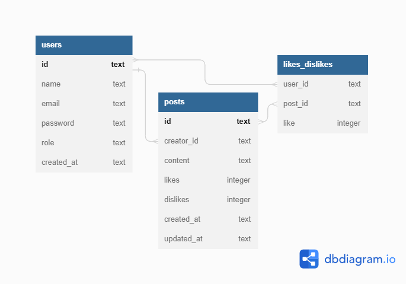

# Projeto labook-backend


O projeto Labook é uma rede social com o objetivo de promover a conexão e interação entre pessoas. Quem se cadastrar no aplicativo poderá criar e curtir publicações.

## Indice
- <a href="#funcionalidades-do-projeto">Funcionalidades do projeto</a>
- <a href="#estrutura-do-banco-de-dados">Estrutura do Banco de dados</a>
- <a href="#demonstração">Demonstração</a>
- <a href="#como-rodar-o-projeto?">Como rodar o projeto?
- <a href="#tecnologias-utilizadas">Tecnologias utilizadas</a>
- <a href="#autor">Autor</a>

## Funcionalidades do projeto

- [x]Cadastrar um novo usuário
- [x]Login do usuario
- [x]Visualizar publicações
- [x]Criar publicações
- [x]Editar publicações
- [x]Deletar publicação
- [x]Like ou dislike

## Estrutura do Banco de dados



## Demonstração
[Link da documentação API](https://documenter.getpostman.com/view/24460946/2s935msk82)

## Como rodar o projeto?

```bash
#Clone este repositório
$ git clone linkdorepositorio

#Acesse a pasta do projeto no seu terminal
$ cd labook-backend

#Instale as dependências
$ npm install

# Execute a aplicação
$ npm rum start

# A aplicação será iniciada na porta 3003, acesse pelo postman e poderá executar os endpoints
```

## Tecnologias utilizadas

1. [Nodejs](https://nodejs.org/en/docs/)
2. [Typescript](https://www.typescriptlang.org/)
3. [Express](https://expressjs.com/pt-br/)
4. [SQLite](https://www.sqlite.org/index.html)
5. [Knexjs](https://knexjs.org/)
6. [POO]()
7. [Arquitetura em camadas]()
8. [Geração de UUID]()
9. [Geração de hashes]()
10. [Autenticação e autorização]()
11. [Roteamento]()
12. [Postman](https://www.postman.com/)

## Autor


[Linkedin](linkedin.com/in/santos-s-gabriel)